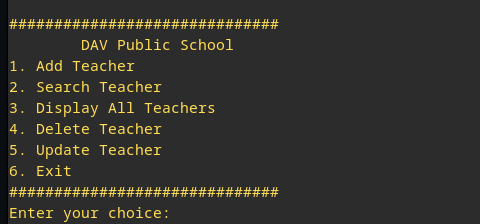

# 📚 Teacher Management System

A simple **Teacher Management System** built using **Python** and **MySQL**.  
This project allows you to **Add**, **Search**, **Display**, **Update**, and **Delete** teacher records in a MySQL database.

---

## 🚀 Features

- Add new teacher details
- Search for a teacher by ID
- Display all teacher records
- Update specific teacher fields (name, gender, salary, etc.)
- Delete a teacher record
- Easy-to-use CLI (Command Line Interface)
- Clean and modular Python code with MySQL database handling

---

## 🛠️ Technologies Used

- Python 3
- MySQL Database
- `mysql-connector-python` library

---

## 📂 Installation Guide

Follow these steps to run the project on your local system:

### 1. Clone the repository
```bash
git clone https://github.com/your-username/teacher-management-system.git
cd teacher-management-system
```

### 2. Set up a virtual environment (Recommended) (For Linux)

```bash
python3 -m venv venv
source venv/bin/activate
```
> For Windows you don't need to go through step 2

### 3. Install required Python libraries

```bash
pip install mysql-connector-python
```

### 4. Set up MySQL Database

- Install MySQL Server (if not installed):

    ```bash
    sudo apt install mysql-server
    ```
    > Not Required for Windows

- Log in to MySQL:

    ```bash
    mysql -u root -p
    ```
    > In Windows can directly open Workbench or MySQL CLI

- Create the database:

    ```sql
    CREATE DATABASE project;
    ```

The table `teacher` will be automatically created when you first run the project!

> **Note**: You can update your MySQL credentials (host, user, password) in the Python code (`tms.py`) if needed.

---

## 🖥️ How to Run

Inside the project folder (For Linux):

```bash
source venv/bin/activate  # (if not already activated)
python tms.py
```
> Not Required for Windows

Follow the on-screen menu to manage teacher records!

---

## 📸 Screenshots



---

## 📄 License

This project is open-source and free to use.

---

## 🤝 Contributing

Pull requests are welcome!  
For major changes, please open an issue first to discuss what you would like to change.

---

## 💬 Contact

For any queries:  
jasdeep.singhh06@gmail.com | [Linkedin](https://www.linkedin.com/in/jasdeep-singh-54ab0423a/)

---

# 🚀 Happy Coding!
